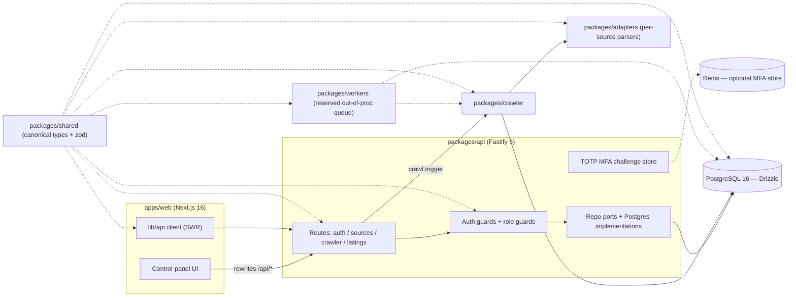

# Code Audit Report: cre-command

**Project:** cre-command
**Version:** 0.1.0
**Date:** 2026-09-10
**Auditor:** create-skill (automated code-audit skill — evidence-based)
**Classification:** Internal — Commercial Real Estate intelligence control panel
**Audited tree:** commit `cd91d83` (main) + **uncommitted working-tree changes** (audit reflects the tree as it is today)

---

## 1. Executive Summary

cre-command is a **TypeScript (strict)** monorepo for Commercial Real Estate (CRE) intelligence: it crawls public listing sources, normalizes heterogeneous data into a canonical schema with first/last-seen observations, deduplicates, and exposes an operational control panel (Next.js) backed by a Fastify REST API and PostgreSQL.

**Architecture:** 7 npm-workspace packages (`api`, `db`, `shared`, `adapters`, `crawler`, `workers`) + 1 application (`apps/web`). Ports-and-adapters on the API side; `packages/shared` is the single source of truth for domain types and enum contracts.

**Current state: BROKEN BUILD (compilation).** `npm run typecheck` **fails in 3 of 8 workspaces** (`db`, `api`, `workers`). The working tree is mid-refactor: an auth change moved the development user into `packages/api/src/auth/dev-user.ts` (untracked), but the two call sites still call `developmentUser()` **as a function** while that file exports a plain object — a guaranteed runtime `TypeError` on the `AUTH_BYPASS` path — and the indentation refactor in `hooks.ts` / `crawlJob.ts` introduced brace imbalances (parser errors). CI's first gate (`npm run typecheck`) would fail, blocking every merge; the README's "typecheck — clean" claim is currently false.

**Security posture:** sound design — opaque hashed bearer sessions, bcrypt, AES-256-GCM MFA, per-IP rate limiting, CORS allowlist, fail-closed crawler policy. **No production secrets found in VCS**; one **test-only AES key file is committed** (`TEST_ENCRYPTION_KEY.txt`). A dependency-vulnerability scan (`npm audit`) was **not run** during this pass (network not guaranteed), so no CVE claims are made here.

**Test coverage:** not re-executed this pass because the tree does not compile (tests run after the typecheck gate in CI). Previously recorded: **254 passing unit tests** (README, 19 files) and **18 API auth tests** (prior isolated run).

**Overall risk rating: HIGH** — the previous report's Critical blocker (incomplete server entry) is **fixed**, but the in-flight refactor currently breaks the build and the dev-auth path.

**Previously reported Critical/High and now resolved in the working tree:**
- `packages/api/src/index.ts` now contains a complete bootstrap — `loadConfig` → `createDatabase` → `buildApp` → `app.listen({ port, host })` (line 155), Redis-backed MFA store, session-pruning timer, SIGTERM/SIGINT graceful shutdown. ✅
- `pnpm-lock.yaml` / `pnpm-workspace.yaml` deleted from the tree (npm workspaces is the only active manager). ✅ (deletion still uncommitted)
- Duplicate `developmentUser()` definitions consolidated into one `dev-user.ts`. ✅ — but see **A2** for the incomplete call-site migration.
---

## 2. Technology Stack (Languages & Frameworks)

**Language histogram** (git-tracked, excluding `node_modules/`; 190 files total):

| Extension | Files | Notes |
|---|---|---|
| `.ts` | 98 | Application + test code (TypeScript) |
| `.tsx` | 35 | Next.js components/pages |
| `.json` | 26 | Manifests, workflows, config |
| `.sql` | 9 | Drizzle schema/migrations |
| `.html` / `.md` | 3 / 3 | Static + docs |
| `.yaml` / `.yml` | 5 | CI workflows, config |
| `.mjs` | 2 | Tooling scripts |
| `.css` / `.js` / `.ps1` | 1 each | Tailwind globals, stray artifacts, launcher |

**Verbatim version evidence:** `packages/*/package.json`, `apps/web/package.json`, root `package.json` (`engines.node: ">=20"`, `typescript: ^5.6.3`).

| Layer | Technology | Version/Spec | Role |
|---|---|---|---|
| **Language** | TypeScript (strict) | `^5.6.3`; `@types/node ^22.10.2` | All 7 packages + web, strict mode |
| **Runtime** | Node.js | `engines: >=20` (CI: node 22) | API via `tsx`, web via Next |
| **Monorepo** | npm workspaces | `packages/*` + `apps/*`; `package-lock.json` | pnpm files deleted (uncommitted) |
| **Frontend** | Next.js | `^16.3.4` App Router; React `^19`, Tailwind `^3.4.17`, SWR `^2.3.0`, `lucide-react ^0.468` | `apps/web` control panel |
| **API** | Fastify | `^5.2.0`; `@fastify/cors ^10.0.1`; `@fastify/rate-limit ^11.0.1` | `packages/api` REST API |
| **Validation** | Zod | `^3.23.8` | Schemas in `shared`/`api` |
| **Database** | PostgreSQL 16 | Drizzle ORM `^0.45.2`, `pg ^8.13.1`, `drizzle-kit ^0.18.1` | `packages/db` (schema+migrations) |
| **Auth** | bcryptjs `^2.4.3` | Opaque bearer sessions; SHA-256 token hashes | `packages/api` |
| **MFA** | TOTP / AES-256-GCM | Key via env; `ioredis ^6.0.0` optional store | `packages/api` |
| **Crawling** | Node `fetch` + cheerio `^1.0.0` | Policy gate → robots → rate-limited HTTP → adapters | `crawler` + `adapters` |
| **Queue/Workers** | Transactional outbox (in-proc) | `packages/workers` reserved for out-of-process queue | workers pkg |
| **Logging** | pino `^9.5.0` | Structured, credential-redacting | api/crawler/workers |
| **Testing** | Vitest `5.0.0` | Root `^5.0.0`; db pins exact `"5.0.0"` (see A6) | unit + integration configs |
| **Dev tooling** | tsx `^4.19.2`, concurrently `^9.1.0` | dev servers | root |

**Version-pinning observation:** nearly every dependency uses caret ranges; `packages/db` uniquely pins `vitest: 5.0.0` and `drizzle-orm: 0.45.2` (root also pins `0.45.2`). No `pnpm-lock`/`yarn.lock` conflict remains in the tree (both pnpm files are deleted locally).

---

## 3. Project Structure

```
cre-command/
├── apps/web/                 # Next.js 16 control panel (Kinetic Noir UI)
│   ├── app/                  # App Router pages: (app)/dashboard|sources|crawler|listings|jobs
│   └── lib/                  # auth context, API client, utils
├── packages/
│   ├── api/                  # Fastify REST API — auth, sources, crawl runs, listings
│   │   ├── src/auth/         #   guards, sessions, TOTP MFA, dev-user
│   │   ├── src/postgres/     #   repo implementations, crawler trigger
│   │   ├── src/routes/       #   route definitions (auth, sources, crawler, listings)
│   │   └── test/             #   auth integration tests
│   ├── crawler/              # Crawl engine: policy → robots → HTTP → adapter → dedup → persist
│   ├── adapters/             # Per-source parsers (vivanuncios; extensible)
│   ├── db/                   # Drizzle schema + Postgres client + migrations
│   ├── shared/               # Canonical domain types & zod schemas (single source of truth)
│   └── workers/              # Out-of-process crawl queue handlers (reserved)
├── docs/                     # ARCHITECTURE.md (spec) + USER_MANUAL.md
├── test-support/ tests/      # Shared test fixtures + root test suites
├── .github/workflows/        # ci.yml, deno.yml
└── configs: package.json tsconfig*.json vitest*.config.ts .env.example .gitignore
```

### 3.1 Architecture diagram — ASCII

```
┌────────────────────────────┐  /api/* rewrite   ┌───────────────────────────────┐
│  apps/web  Next.js 16      │ ───────────────▶  │ packages/api  Fastify 5       │
│  control panel (React 19)  │                   │  routes: auth|sources|crawler │
│  lib/api client (SWR)      │◀─── shared types ─│  auth guards + role guards    │
└────────────────────────────┘                   │  repo ports + postgres impls  │
        │                                        └──────┬───────────────┬────────┘
   (canonical types/zod)                                │               │
   packages/shared ─────────────────────────────────────┼───────────────┤
                                                        │               ▼
                   ┌────────────────────────────┐       │        PostgreSQL 16
                   │  packages/crawler  engine  │       │        (Drizzle)
                   │  policy→robots→http→parse  │──────▶│
                   │  →fingerprint→dedup→persist│       │
                   └─────────┬──────────────────┘       │
                             │ uses                     │
                             ▼                          │
                   packages/adapters (per-source) ──────┘
   packages/workers (out-of-process queue, reserved) ──▶ crawler / adapters / db
   Redis (optional) ◀── MFA login challenges ── packages/api
```

### 3.2 Architecture diagram — Mermaid (renders on GitHub)



### 3.3 ERD summary (from packages/db schema + docs/ARCHITECTURE.md §4)

```
users ──< sessions
sources ──< crawl_runs
sources ──< listings ──< listing_observations
contacts (placeholder for CRM phase)
```

- **sources** — adapter key, baseUrl, schedule, config jsonb, compliance policy (`crawl_allowed`, `robots_policy`, `rate_limit_ms`, `max_workers`, `authentication_required` — fail closed).
- **listings** — canonical row: source FK, external id, address/geo, price amount/currency/unit, size, listedAt, status, provenance + fingerprint.
- **listing_observations** — append-only per-sight record (price, payload, seen_at, run id): the "what was the price before?" audit trail.
- **crawl_runs** — status `queued|running|completed|completed_with_errors|failed|cancelled`, counters, structured errors array.

### 3.4 Internal package dependency map (from each package.json)

| Package | Depends on (@cre/*) | External highlights |
|---|---|---|
| `@cre/api` | adapters, crawler, db, shared | fastify, bcryptjs, zod, ioredis, pino |
| `@cre/crawler` | adapters, db, shared | pino |
| `@cre/adapters` | shared | cheerio |
| `@cre/db` | shared | drizzle-orm, pg |
| `@cre/workers` | adapters, crawler, db, shared | pino |
| `@cre/web` | shared | next, react, swr |

`shared` is an acyclic root with no internal deps — clean dependency inversion.

---

## 4. Build, Tooling & CI/CD

**Root scripts (package.json):**

| Script | Command | Gate role |
|---|---|---|
| `dev` | `concurrently -k -n WEB,API ... dev:web + dev:api` | local dev (web 3000 + API 4000) |
| `dev:web` / `dev:api` / `dev:workers` | `npm run dev -w <ws>` | per-workspace dev |
| `typecheck` | `tsc -p` × 8 chained with `&&` | **CI gate #1 — currently RED (see A1)** |
| `test:unit` | `vitest run --config vitest.unit.config.ts` + web tests | CI gate #2 |
| `test:integration` | `vitest run --config vitest.integration.config.ts` | CI gate #4 (needs PG + Redis) |
| `build:web` | `npm run build -w apps/web` | CI gate #5 |
| `db:migrate` / `db:generate` | `tsx src/postgres/migrate.ts` / drizzle-kit | ops |

**Compiler baseline (`tsconfig.base.json`):** `strict: true`, `target ES2022`, `moduleResolution: Bundler`, `isolatedModules`, `noEmit`, `forceConsistentCasingInFileNames`. ⚠️ **No ESLint, no Prettier, no formatter config in the repo** — formatting consistency is unenforced (see A5).

**Test tooling:** Vitest 5 — root config discovers `packages/**/test/**` + `tests/**`; `vitest.unit.config.ts` runs node-env suites; `vitest.integration.config.ts` targets PG/Redis suites. CI sets `CRE_ENFORCE_INTEGRATION=1` so missing services **fail** rather than silently skip — good discipline.

**CI/CD (`.github/workflows/`):**

| Workflow | Triggers | Steps / Gates | Notes |
|---|---|---|---|
| `ci.yml` | PR + push→master | npm ci → **typecheck** → unit tests → migrate fresh PG16 → integration tests (PG16 + Redis7 health-gated service containers) → `build:web` | npm cache keyed on `package-lock.json`; inline test-only `MFA_ENCRYPTION_KEY`. **Fails today at the typecheck step.** |
| `deno.yml` | PR + push→main | `deno lint` → `deno test -A` | **No Deno code exists in this repo** (npm/TS project) — workflow is inert noise (A8). |

**Local launchers (untracked dev helpers):** `start-api{,-cmd,-full}.bat`, `start-api.cmd`, `start-api.ps1`, `run-tests.bat/.cmd` — not part of root scripts; they duplicate documented npm commands (drift risk, A9).

---

## 5. Configuration & Secrets Hygiene

| Check | Result | Evidence |
|---|---|---|
| `.gitignore` coverage | **Good** — `node_modules/`, `dist/`, `.next/`, `out/`, `coverage/`, `data/`, `exports/**`, `.env`, `.env.local`, `.env.*.local`, logs, `.vscode/*` | root `.gitignore` |
| `.env` tracked? | **No** — properly ignored ✅ | `git ls-files .env` → empty |
| **Committed key material** | ⚠️ `TEST_ENCRYPTION_KEY.txt` **is VCS-tracked** (added in `7d35b9e`); content: a 64-hex-char AES key. Matches the inline CI test key; **test-only**, but keys in VCS must be removed/rotated/documented (A4). | `git ls-files TEST_ENCRYPTION_KEY.txt`; file content |
| Real secrets in tracked files | None found (grep for `sk-`, `AKIA`, `BEGIN PRIVATE KEY`, `password=` over tracked files) | git grep |
| `.env.example` quality | **Strong** — production template, `CHANGE-ME` placeholders, CORS exact-origin policy (never `*`), separate login rate limit, body limit, `TRUST_PROXY` caveat, bootstrap-admin "honored only while users table is empty", MFA key generation hint | `.env.example` |
| Dev backdoor `AUTH_BYPASS` | Gated to development only: `const isBypass = authBypass && nodeEnv === "development"` — safe in principle; **but the bypass path currently crashes at runtime** (A2) | `packages/api/src/auth/hooks.ts:53-58` |

---

## 6. Security Review (static)

**AuthN/AuthZ — well designed.** Opaque bearer sessions; tokens hashed at rest (`hashToken`, SHA-256) and looked up via `findActive`; session TTL bounded by env (`CRE_SESSION_TTL_HOURS`, 1h–90d clamp); expired rows pruned hourly (unref'd timer) plus at shutdown; passwords hashed with bcryptjs; role guards `viewer < operator < admin` via `requireRole`; bootstrap admin honored only while the users table is empty — correct fail-closed behavior.

**MFA (TOTP, RFC 6238)** — secrets AES-256-GCM encrypted (`MFA_ENCRYPTION_KEY`); single-use challenges; Redis-backed optional store for multi-instance deployments with a clear in-process fallback; verify endpoint rate-limited (env-tunable). Key-material review: only the `CHANGE-ME` placeholder and the committed test key exist.

**Request hardening** — `@fastify/rate-limit` per-client-IP sliding window (`RATE_LIMIT_MAX=300/min`), separate `LOGIN_RATE_LIMIT_MAX=10`; CORS allowlist from `CORS_ORIGINS` (never `*`; empty = same-origin — correct for the Next proxy); `BODY_LIMIT_BYTES=1048576`; `TRUST_PROXY` opt-in behind a proxy that overwrites `X-Forwarded-For`.

**Crawler SSRF/compliance posture — strong.** Per-source **fail-closed policy gate** (unknown/disabled/`authentication_required` → reject); robots.txt honoring (RFC 9309 subset; `strict` requires a parseable allow); honest User-Agent; 2 MiB bounded reads; per-source rate limiting; exponential backoff on retryable failures only; explicit no-bypass of CAPTCHA/anti-bot/paywalls. Residual risk: sources are operator-configured URLs fetched server-side — mitigate via the policy gate + the observations audit trail.

**Findings from this pass:** no production credentials in VCS; no obvious SQL interpolation (Drizzle + parameterized repos), Zod-validated inputs on API routes, pino structured logging with credential redaction (per docs). **Limitation:** `npm audit` (CVE scan) was **not run** — network was not guaranteed; no vulnerability claims are made in this report.

---

## 7. Code Quality & Test Coverage

**Typecheck — measured this session** (each workspace run individually, because the root script's `&&` chain stops at the first failure):

| Workspace | Result | Evidence (verbatim) |
|---|---|---|
| packages/shared | ✅ clean | `tsc -p` exit 0 |
| packages/db | ❌ FAIL | `packages/db/src/postgres/drizzle.config.ts(1,10): error TS2305: Module '"drizzle-kit"' has no exported member 'defineConfig'.` |
| packages/adapters | ✅ clean | exit 0 |
| packages/crawler | ✅ clean | exit 0 |
| packages/api | ❌ FAIL | `packages/api/src/auth/hooks.ts(91,2): error TS1005: '}' expected.` |
| packages/workers | ❌ FAIL | `packages/workers/src/crawlJob.ts(42,7): error TS1005: ',' expected.` + 13 more TS1005/TS1109 at lines 42–52 |
| apps/web | ✅ clean | exit 0 |
| root (tsconfig.json) | ✅ clean | exit 0 |

**Root-cause reading (from reading the sources):**
- `packages/workers/src/crawlJob.ts` — `buildCrawler()` (lines 32–43) opens `new Crawler({` and a nested `HttpRobotsChecker({` but the object literal and constructor are **never closed** (missing `})`); the parser cascades errors through lines 42–52.
- `packages/api/src/auth/hooks.ts` — brace imbalance so the parser reaches EOF (line 91, col 2) still expecting a `}`; the 4-space-indentation refactor (A5) inside `createAuthGuards` is the likely culprit.
- `packages/db` — `drizzle.config.ts:1` imports `defineConfig` from `drizzle-kit`, which at `^0.18.1` as installed **does not export that symbol** — use a plain config object or pin a compatible kit version.

**Lint/format:** none configured (no `.eslintrc*`, `.prettierrc*`, no `lint` script beyond the inert `deno.yml`). **No `TODO`/`FIXME`/`HACK` debt** in tracked source — `git grep` returns only base64 false positives in `package-lock.json`. ✅

**Tests:** not re-executed this pass — the working tree does not compile, and CI's typecheck gate runs before tests by design. Prior recorded: **254 unit tests passing across 19 files** (README §Verification status) and **18 API auth tests** (previous isolated run; `packages/api/test/auth.test.ts` is modified in the tree). `CRE_ENFORCE_INTEGRATION=1` ensures integration suites cannot silently skip. Re-run is mandatory once A1–A3 are fixed.

**Documentation drift:** README claims "typecheck — clean across … 8 strict passes" and ARCHITECTURE.md still documents **Next.js 15** (repo is on 16) — both stale (A7).

---

## 8. Audit Findings Register

| ID | Severity | Component | Evidence | Impact | Status |
|---|---|---|---|---|---|
| A1 | **Critical** | build / CI | `npm run typecheck` fails in `db`, `api`, `workers` (errors quoted in §7) | Every merge is blocked by the CI typecheck gate; README's "clean" claim is false; integration tests cannot run | Open |
| A2 | **High** | api/src/auth | `hooks.ts:56` and `routes/auth.ts:86` call `developmentUser()`; `auth/dev-user.ts:2` exports a plain object (`export const developmentUser = {…}`) | Runtime `TypeError: developmentUser is not a function` whenever the dev `AUTH_BYPASS` path executes (dev/demo and the new tests); refactor left incomplete | Open |
| A3 | **Medium** | packages/db | `src/postgres/drizzle.config.ts:1` imports `defineConfig` from `drizzle-kit ^0.18.1`, which does not export it (TS2305) | DB migrations tooling and `db` typecheck broken until config/kit version aligned | Open |
| A4 | **Low** | repo hygiene | `TEST_ENCRYPTION_KEY.txt` tracked in VCS (commit `7d35b9e`) — 64-hex AES key, test-only per CI usage | Keys in VCS erode the "no secrets in git" guarantee; requires rotation/removal discipline | Open |
| A5 | **Low** | api/src/auth | `hooks.ts` uses 4-space indentation inside `createAuthGuards` (lines 54–90) vs the 2-space project convention; no formatter enforces it | Style inconsistency; the refactor that introduced A1's syntax error | Open |
| A6 | **Low** | packages/db | `package.json` lists `"vitest": "5.0.0"` under `dependencies` (should be `devDependencies`), exact-pinned vs root `^5.0.0` | Test tooling ships in the prod dependency tree; spec drift | Open |
| A7 | **Low** | docs | README "typecheck — clean" / "254 passed" claims; ARCHITECTURE.md says Next.js 15 (now 16) | Auditors/maintainers misled about build health | Open |
| A8 | Info | CI | `.github/workflows/deno.yml` runs `deno lint` / `deno test -A` on a repo with **no Deno code** | Inert workflow — wasted CI time or silent false confidence | Open |
| A9 | Info | repo hygiene | Untracked clutter in tree root: `query` (contains "PostgreSQL17"), `test-*.txt`/`api-*.txt` outputs, `run-tests.*`, `start-api*` launchers | Working-tree noise; launchers diverge from npm scripts | Open |
| A10 | Info | VCS state | 9 modified + 14 untracked files; the entire auth refactor (including `dev-user.ts`) is uncommitted | Tree cannot be reproduced from HEAD; a fresh checkout is green — the breakage lives only in the workspace | Open |
| A11 | Info | audit limit | `npm audit` not run (no network guarantee this session) | Dependency CVE posture unconfirmed | Not run |

**Resolved since the previous audit report:** server entry complete with `listen()`/graceful shutdown/Redis (was Critical); pnpm-vs-npm lockfile mismatch (files deleted); duplicate dev-user definition (consolidated). Note the pnpm-file deletions are themselves uncommitted.

---

## 9. Recommendations

1. **URGENT — restore compilation.** Fix `hooks.ts` (balance braces; finish the 2-space indent), `crawlJob.ts:32-43` (close the `Crawler({…})`/`HttpRobotsChecker({…})` literal), and `drizzle.config.ts` (drop/alias `defineConfig` for drizzle-kit `^0.18.1`). Verify each with `npx tsc -p <ws> --noEmit` until all 8 are green.
2. **URGENT — fix the dev-user call sites.** Change `hooks.ts:56` / `routes/auth.ts:86` to use the object (`request.user = developmentUser`) or convert `dev-user.ts` to a factory function if object identity matters; then add a regression test for the `AUTH_BYPASS` path.
3. **SHORT — prove the suite.** Once green: `npm run typecheck && npm run test:unit`, then reconcile README (restore accurate counts or fix code). Also run `npm audit` with network and record results here.
4. **SHORT — purge the committed test key.** `git rm --cached TEST_ENCRYPTION_KEY.txt`, add it (or a `*.key`/`*KEY*.txt`) to `.gitignore`, rotate the CI value, and document that CI injects its own test key.
5. **SHORT — package hygiene.** Move `vitest` to `devDependencies` in `packages/db`; align the spec with root (`^5.0.0`).
6. **MEDIUM — enforce formatting.** Add ESLint + Prettier (or invoke `deno fmt --check` if adopting Deno for scripts) so indentation regressions like A5 are caught in CI.
7. **MEDIUM — delete/re-scope `deno.yml`** — it lint-tests a repo with no Deno code.
8. **MEDIUM — commit the refactor deliberately.** Land `dev-user.ts` + call-site fixes as one reviewed change with the bypass test, so HEAD matches the audited state.
9. **LONG — tidy the tree.** Move launchers into root scripts (`start:api`, `test:unit:web`), delete or gitignore the output `.txt`/`query` artifacts, and host test outputs under `test-support/results/`.

---

## 10. Source Index (Key Files)

| Component | Primary files |
|---|---|
| API entry (composition root) | `packages/api/src/index.ts` |
| API factory (testable) | `packages/api/src/app.ts` |
| Config loading | `packages/api/src/config.ts` |
| Auth guards & roles | `packages/api/src/auth/hooks.ts` |
| Auth routes | `packages/api/src/routes/auth.ts` |
| Dev bypass user | `packages/api/src/auth/dev-user.ts` |
| MFA TOTP + challenges | `packages/api/src/auth/mfa-*.ts`, `redis-mfa-challenges.ts` |
| Ports & Postgres repos | `packages/api/src/ports.ts`, `postgres/repositories.ts`, `postgres/crawler.ts` |
| Crawler engine | `packages/crawler/src/crawl.ts` (+ policy/robots/http/rate-limit/fingerprint) |
| Adapter registry | `packages/crawler/src/registry.ts`; `packages/adapters/src/**` |
| DB schema/client/migrations | `packages/db/src/postgres/{schema,client,migrate,migrations}.ts` |
| Shared canonical types | `packages/shared/src/index.ts` |
| Worker queue handler | `packages/workers/src/crawlJob.ts` |
| Web layout / auth / API client | `apps/web/app/layout.tsx`, `apps/web/lib/auth/auth-context.tsx`, `apps/web/lib/api/` |
| Architecture / ops docs | `docs/ARCHITECTURE.md`, `docs/USER_MANUAL.md` |

---

## 11. Evidence & Verification Notes

Commands actually run this pass (all non-interactive, read-only):
- `git status --porcelain`, `git --no-pager log --oneline -10`, `git ls-files` (histogram + `TEST_ENCRYPTION_KEY.txt` check), `git grep -n -E 'TODO|FIXME|HACK|XXX'`, secret-pattern grep over tracked files.
- `npx tsc -p <ws> --noEmit` for all 8 workspaces (errors quoted verbatim in §7).
- `npm run typecheck` (root; demonstrates the `&&`-chain stop at `db`).
- File reads: root + per-package manifests, `.env.example`, `.gitignore`, `tsconfig.base.json`, `vitest*.config.ts`, `.github/workflows/*`, `docs/ARCHITECTURE.md`, `apps/web/package.json`, `packages/api/src/index.ts`, `hooks.ts`, `routes/auth.ts`, `dev-user.ts`, `crawler/registry.ts`, `workers/crawlJob.ts`, `apps/web/app/layout.tsx`, `apps/web/lib/auth/auth-context.tsx`.

Not run (explicitly): unit/integration test suites (tree does not compile; CI runs tests only after the typecheck gate), `npm audit` (network not guaranteed), and any mutation of the database or git state.

*End of Report — generated by the `create-skill` audit skill. It supersedes the earlier report artifact from the prior session (that untracked file is no longer on disk, so no previous copy was preserved).*
